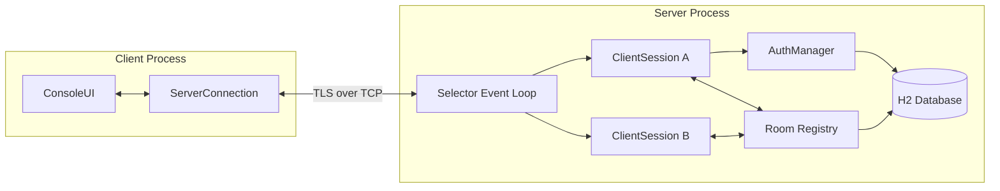

# Architecture

## Module layout

```
darts-java/
  common/
    darts/common/
      Protocol.java        # message type constants, framing logic
      Message.java          # message data class (immutable)
      CryptoUtils.java       # hashing / TLS helper utilities
  server/
    darts/server/
      Server.java            # entry point, Selector event loop
      ClientSession.java      # per-connected-client state (non-blocking)
      Room.java                 # room membership + broadcast logic
      AuthManager.java           # login/register, password verification
      Database.java                # H2 connection + queries
  client/
    darts/client/
      Client.java            # entry point, connects + runs UI loop
      ConsoleUI.java           # terminal rendering, input parsing
      ServerConnection.java     # socket handling, send/receive
  lib/                     # manually-placed .jar dependencies (H2 driver)
  scripts/
    compile.sh
    run-server.sh
    run-client.sh
  docs/                   # this document set
```

No package should import "upward" — `server` and `client` may both depend
on `common`, but `common` must never depend on `server` or `client`. This
keeps the protocol layer honest and reusable.

## Runtime architecture



## Why a single-threaded Selector loop (not thread-per-client)

This mirrors the original C server's `select()` design deliberately — it's
the harder, more "real" approach and avoids thread-safety bugs by
construction (only one thread ever touches shared state like the room
registry). The tradeoff: handlers must never block. Any blocking work
(database queries, password hashing) must run on a small worker thread pool
and hand results back via a queue the Selector thread drains each loop
iteration — never do blocking I/O directly on the Selector thread.

## Data flow for a single chat message

1. Client reads a line from stdin (`ConsoleUI`).
2. `ServerConnection` wraps it as a `Message`, serializes via `Protocol`,
   writes to the TLS-wrapped `SocketChannel`.
3. Server's Selector wakes on read-readiness for that channel, hands bytes
   to the owning `ClientSession`.
4. `ClientSession` deserializes into a `Message`, checks auth state, hands
   off to the target `Room`.
5. `Room` looks up member sessions, queues the message for write on each
   one, and asynchronously persists it via the worker pool → `Database`.
6. Each recipient's Selector wakes on write-readiness, sends the bytes.

## Concurrency model

- **Selector thread**: owns all socket I/O and in-memory room/session state.
  Nothing else touches these structures — no locks needed there.
- **Worker pool** (small fixed `ExecutorService`): handles DB writes,
  password hashing (deliberately slow operations), and TLS handshake CPU
  work if needed. Results are pushed to a thread-safe queue the Selector
  loop drains each iteration.
- **Client side**: a UI/input thread and a network read thread — this is
  the one place we do use two threads, since it's a single connection with
  no shared mutable state beyond a `volatile` connection-alive flag.

## Extension points

- New message types: add to `Protocol.java`'s type enum + a handler case in
  `ClientSession`. Nothing else needs to change.
- New persistence needs: add a method to `Database.java`; callers never
  write raw SQL outside that class.
- New client commands: add to `ConsoleUI`'s command dispatch table.
