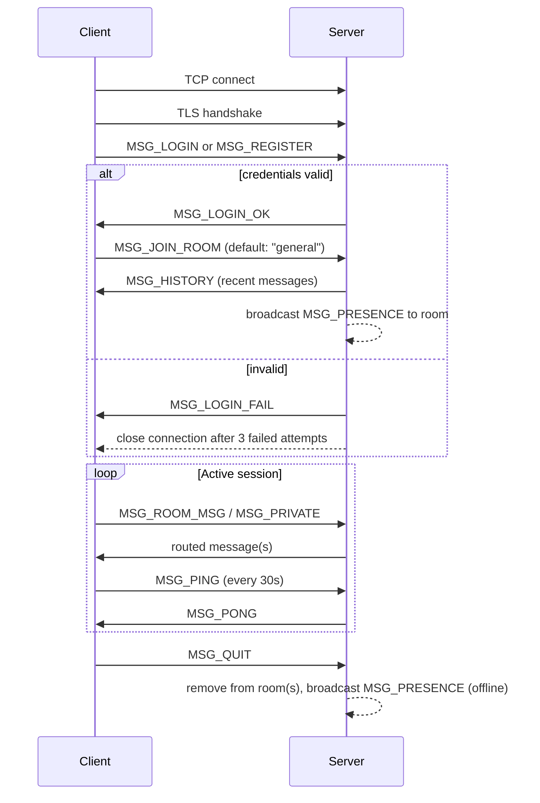

# Wire Protocol Specification

This is the contract between `client` and `server`. Any change here must be
agreed on by whoever owns the other side — this file is the source of truth,
not the code.

## Transport

- TCP, wrapped in TLS (see `05_SECURITY.md`) after an initial plaintext
  handshake negotiation.
- All application messages are **length-prefixed** to avoid the classic
  "how do I know where one message ends" problem:

```
[4 bytes: payload length, big-endian int] [payload bytes]
```

- Payload is UTF-8 encoded JSON (chosen over a fixed C-style struct
  specifically so new fields can be added without breaking older clients —
  the #1 flexibility gap in the original C protocol).

## Message envelope

Every message, in both directions, has this shape:

```json
{
  "type": "MSG_LOGIN",
  "from": "alice",
  "to": null,
  "room": "general",
  "body": "hello everyone",
  "timestamp": 1737590400000
}
```

| Field | Type | Notes |
|---|---|---|
| `type` | string | one of the message types below |
| `from` | string or null | sender username; null before login completes |
| `to` | string or null | target username, only for private messages |
| `room` | string or null | target room, only for room messages |
| `body` | string | message content / command payload |
| `timestamp` | long | client-set send time, epoch millis |

## Message types

| Type | Direction | Purpose |
|---|---|---|
| `MSG_LOGIN` | C→S | `body` = password (sent only after TLS is established) |
| `MSG_REGISTER` | C→S | create new account |
| `MSG_LOGIN_OK` | S→C | login accepted |
| `MSG_LOGIN_FAIL` | S→C | `body` = reason |
| `MSG_JOIN_ROOM` | C→S | `room` = target room, creates if `MSG_CREATE_ROOM` was used first |
| `MSG_LEAVE_ROOM` | C→S | |
| `MSG_ROOM_MSG` | C↔S | broadcast to `room` |
| `MSG_PRIVATE` | C↔S | direct message to `to` |
| `MSG_USER_LIST` | C→S request, S→C response | `body` = comma-separated online users |
| `MSG_ROOM_LIST` | C→S request, S→C response | |
| `MSG_HISTORY` | S→C | sent on room join, replays recent messages |
| `MSG_PRESENCE` | S→C | broadcast when a user's status changes |
| `MSG_ADMIN_KICK` | C→S | admin-only, `to` = target user |
| `MSG_ERROR` | S→C | `body` = human-readable error |
| `MSG_PING` / `MSG_PONG` | C↔S | heartbeat, see below |
| `MSG_QUIT` | C→S | clean disconnect |

## Session lifecycle



## Heartbeat

Client sends `MSG_PING` every 30 seconds. If the server receives no traffic
(ping or otherwise) from a client for 90 seconds, it treats the connection
as dead, cleans up the session, and broadcasts presence-offline.

## Error handling rule

The server never silently drops a malformed message. If `type` is unknown
or a required field is missing, respond with `MSG_ERROR` and keep the
connection alive — don't disconnect on malformed input alone (that's a
denial-of-service vector against yourself).

## Versioning

Not versioned in v1 (single client/server pair, always upgraded together).
If this becomes a concern, add a `protocolVersion` field to the envelope —
noted here so nobody has to rediscover this decision later.
